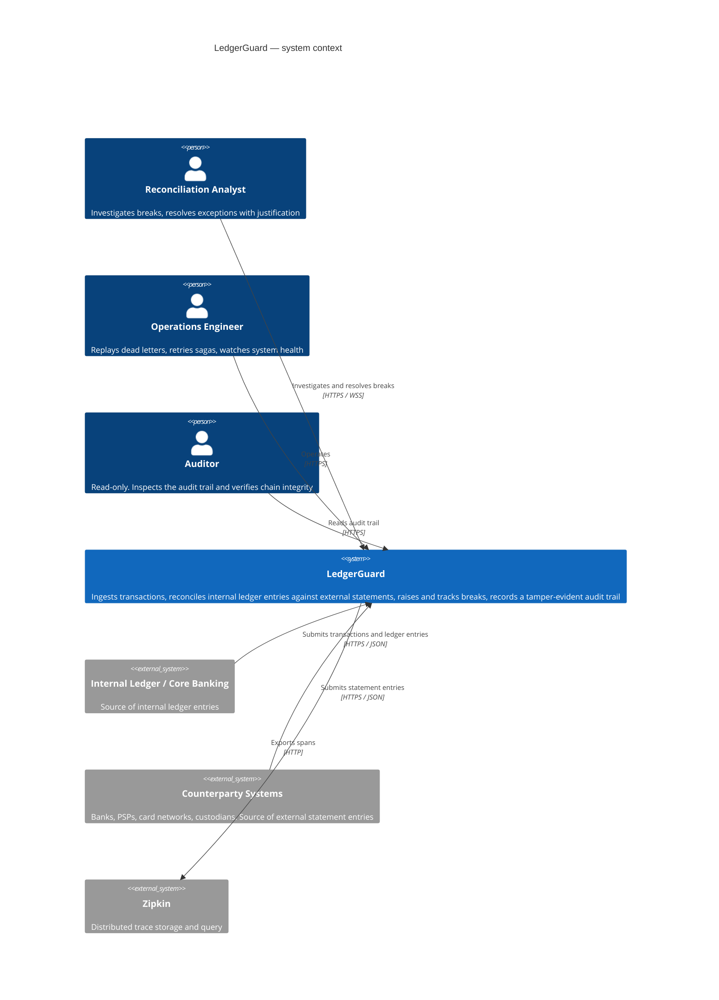
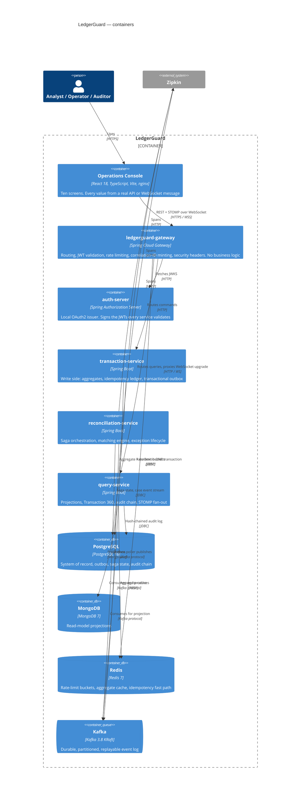
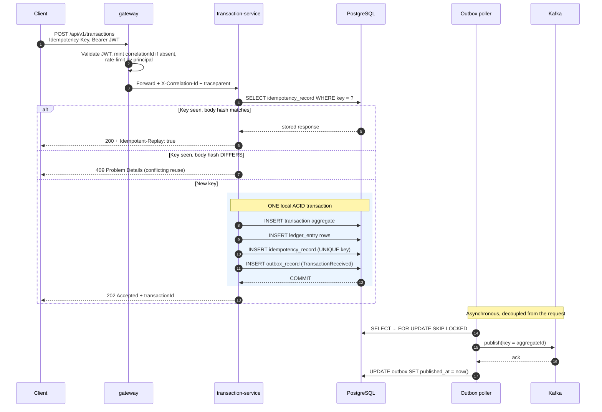
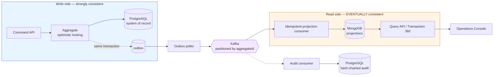
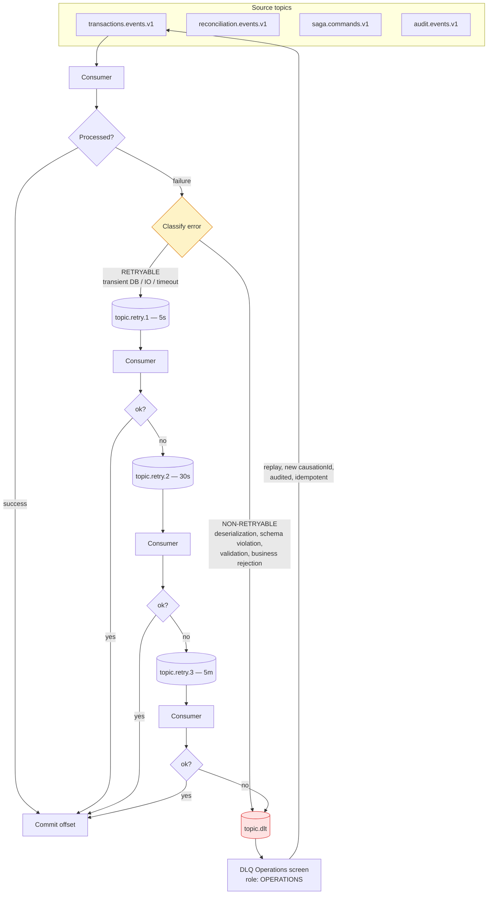
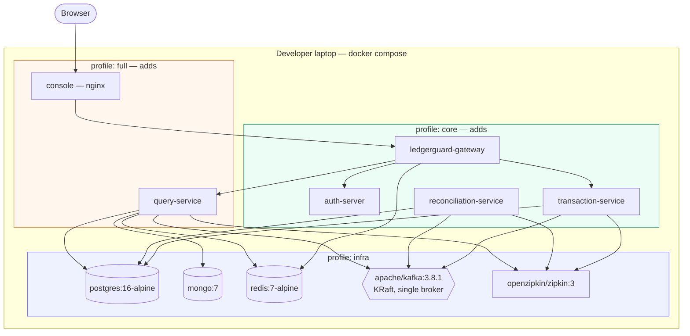

# Architecture

> **Status of this document.** The diagrams and the rejected-pattern reasoning are complete as of
> Phase 1. Sections marked *(implemented in Phase N)* describe intent that the code does not yet
> fulfil. Every such marker is removed only when the corresponding code exists and is tested —
> a diagram that does not match the implementation is a defect, and the Phase 15 audit checks
> exactly this.

## 1. System context (C4 level 1)

**Scope note.** Counterparty and core-banking systems are *external actors* in this diagram. In the
local stack they are simulated by the demo scripts in `scripts/demo/` posting to the same public
API — there is no separate simulator service, and no file-transfer or SWIFT ingestion channel.
That is a deliberate scope limit, not an omission to be discovered later.

## 2. Container diagram (C4 level 2)

Why each service is a separate deployable — and why there are four rather than one or twelve — is
argued in [ADR-0001](adr/0001-service-decomposition.md). Why `query-service` touches three
datastores is [ADR-0014](adr/0014-audit-chain-in-postgresql.md), which is a documented deviation
from the specification.

## 3. Transaction ingestion — the write path

**The failure window is deliberate and visible in this diagram.** If the poller crashes between the
Kafka ack and the `UPDATE`, the record is re-claimed and republished on restart — the event is
delivered twice. That is at-least-once delivery, and it is why every consumer is idempotent
([ADR-0006](adr/0006-at-least-once-and-idempotency.md)). It is not a bug to be fixed; it is the
guarantee this system actually provides.

## 4. CQRS — and where consistency stops being immediate

**The orange boundary is the honest part of this system.** A write that returns `202` is durable in
PostgreSQL but is **not yet visible** in the read model. The delay is the outbox poll interval plus
Kafka delivery plus projection time.

The console does not hide this. Projection lag — measured as event `occurredAt` to projection
`updatedAt` — is surfaced in the UI header and exported as a metric. A CQRS system that pretends
its read model is current is lying to its operators at exactly the moment they most need the truth.

## 5. Kafka topology, retries, and dead letters

The classification step is the substantive part. A malformed payload will fail identically in 5
seconds, 30 seconds, and 5 minutes — sending it round the ladder wastes the retry budget and
**delays the operator's discovery of the problem by five and a half minutes**. Reasoning in
[ADR-0012](adr/0012-non-blocking-retry-topics.md).

Retry delays carry jitter so that a recovering dependency is not hit by every retry at once.

## 6. Local deployment topology

Profiles exist so the stack can be run at three different costs:

| Profile | Contents | Purpose |
|---|---|---|
| `infra` | Datastores + Kafka + Zipkin only | Run services from an IDE |
| `core` | `infra` + auth, transaction, reconciliation, gateway | Minimum viable demo of the write path and reconciliation |
| `full` | Everything, including the console | Complete demo |

*Measured RAM cost per profile is recorded in Phase 2's report, from `docker stats` on the
reference machine — it is deliberately not estimated here.*

## 7. Patterns and technologies deliberately rejected

Every entry below was considered and rejected. Listing them is as much a part of the architecture
as the things that were adopted, because "what did you decide **not** to build" is the question
that separates a designed system from an accumulated one.

| Rejected | Why |
|---|---|
| **Service mesh** (Istio/Linkerd) | Solves mTLS, retries, and traffic shifting across many services and teams. With four services in one compose file, it adds a control plane and sidecar-per-pod memory cost to solve problems we do not have. Retries and timeouts are handled in-process where they are visible in code. |
| **Kubernetes as the primary deployment story** | The target is a laptop. K8s manifests would be untested aspiration — nobody would run them, so they would rot. Docker Compose is what this project can actually verify, so it is what it ships. |
| **Confluent Schema Registry** | Another container to enforce what CI can enforce at build time. See [ADR-0007](adr/0007-schema-in-repo.md). |
| **Distributed XA transactions** | Two-phase commit across PostgreSQL and Kafka: poor availability (a coordinator failure blocks participants holding locks), poor performance, and poor support. The saga plus outbox exists precisely because XA is the wrong answer. |
| **gRPC between services** | Services communicate by **events over Kafka**, not by synchronous calls. Adding gRPC would mean adding synchronous coupling the architecture deliberately avoids. |
| **GraphQL** | The console's queries are well-known and server-shaped. GraphQL's flexibility buys nothing when there is exactly one client, and it complicates authorization (per-field rules), caching, and rate limiting — all of which matter here. |
| **A second message broker** (RabbitMQ alongside Kafka) | Kafka's log semantics are required for replay and projection rebuild. Nothing here needs per-message routing or acknowledgement semantics that Kafka lacks. |
| **Elasticsearch** | Grid filters are structured, not full-text. Compound indexes serve them. See [ADR-0002](adr/0002-polyglot-persistence.md). |
| **A rules DSL interpreter** | A DSL means writing a parser, an evaluator, error reporting, and tooling — then debugging *the DSL* instead of the rules. The rules are versioned configuration evaluated by ordinary, individually-testable Java. Explainability comes from structured output, not from grammar. |
| **Any ML/LLM in the reconciliation decision path** | Financial correctness must be deterministic, reproducible, and explainable. A model that is 99% accurate is 1% unexplainable, and "the model decided" is not an answer to an auditor. See `docs/reconciliation-engine.md`. |
| **Workflow engine** (Temporal/Camunda/Axon) | The mechanism is the deliverable. See [ADR-0004](adr/0004-orchestrated-saga-hand-rolled.md), which also states when Temporal *would* be right. |

## 8. Resource budget

Target from the build specification: full stack under **10 GB RAM** and **6 CPU cores**, cold start
to healthy under **5 minutes**.

The reference machine for this repository has **4 cores**, not 6 — recorded in
`docs/phase-reports/phase-00.md` §2. Cold-start timings will therefore be slower than the target
assumes. Actual measurements land in Phase 2's report; no number is claimed here in advance.

## Related documents

- [Architecture Decision Records](adr/README.md) — the reasoning behind every choice above
- [`domain-model.md`](domain-model.md) — entities, state machines, invariants
- [`reconciliation-engine.md`](reconciliation-engine.md) — the matching pipeline
- [`saga.md`](saga.md) — orchestration and compensation
- [`reliability.md`](reliability.md) — what is and is not guaranteed
- [`failure-modes.md`](failure-modes.md) — the operational runbook
