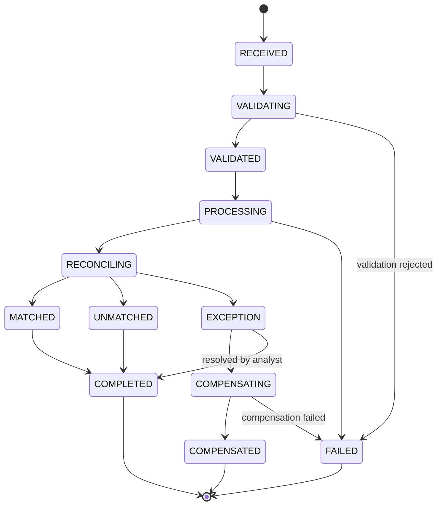
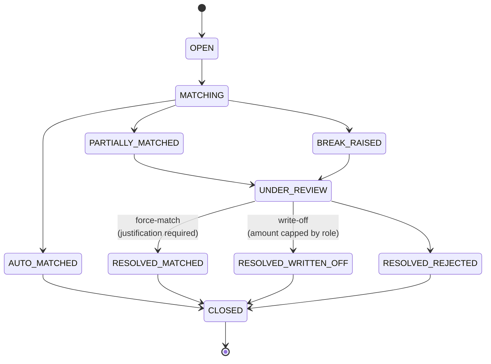
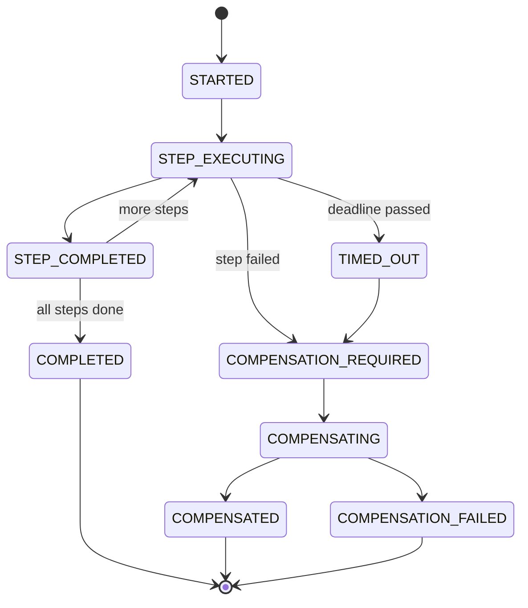

# Domain model

> **Status.** State machines and invariants are specified and diagrammed as of Phase 1. The types
> are implemented in Phase 3 (`Money`, identifiers, clock) and Phases 4–6 (aggregates). Where this
> document and the code disagree, the code is authoritative and this document is a defect.

## 1. Money

The full reasoning is [ADR-0009](adr/0009-monetary-representation.md). The rules the code must
enforce:

| Rule | Consequence of getting it wrong |
|---|---|
| `BigDecimal amount` + ISO 4217 `CurrencyCode`, immutable, final | A bare number is meaningless and silently mixes currencies |
| Scale derives from the currency's minor units (JPY 0, USD/EUR 2, BHD/KWD 3) | A hardcoded scale of 2 is wrong for a third of the world |
| Excess precision is **rejected on construction**, never truncated | Silent truncation is how money disappears |
| Cross-currency arithmetic **throws** | Implicit conversion produces a plausible wrong number |
| Equality uses `compareTo` semantics for the amount | `BigDecimal.equals` says `2.50 != 2.5` — a notorious bug source |
| `HALF_EVEN` for derived values; **stored amounts are never rounded** | `HALF_UP` biases upward systematically across a population |
| Persisted as `NUMERIC(19,4)` + `CHAR(3)`, never one column, never floating point | Irrecoverable precision loss |
| Serialised to JSON as a **string** | `JSON.parse` yields an IEEE-754 double and destroys the value at the browser boundary |

No `double`, `float`, `Double`, or `Float` appears anywhere near money. Enforced by an ArchUnit
rule and a CI grep.

## 2. Identifiers and time

**Identifiers** — `transactionId`, `caseId`, `sagaId`, `eventId` are UUIDv7
([ADR-0010](adr/0010-uuidv7-identifiers.md)): time-ordered, so they preserve B-tree index locality
while still being generated without a database round trip.

**Correlation and causation** are distinct and both matter:

- `correlationId` — minted at the gateway if absent, propagated through HTTP headers, Kafka
  headers, MDC, and into the UI. **One business flow = one correlation ID.** It answers "show me
  everything that happened because of this request."
- `causationId` — the `eventId` or `commandId` that *directly* caused this event. It answers "what
  specifically triggered this?" Together they reconstruct a causal tree, which is exactly what
  Transaction 360 renders.

**Time** — three timestamps, deliberately distinguished, because collapsing them destroys the
ability to diagnose latency:

| Field | Meaning |
|---|---|
| `occurredAt` | When the business event happened (event time) |
| `recordedAt` | When it was persisted |
| `processedAt` | When a consumer handled it |

Transaction 360 shows the deltas between them — that is how an operator sees *where* time went.

All time is UTC `java.time.Instant`. `java.time.Clock` is injected everywhere so tests use a fixed
clock. **No `LocalDateTime`, no `new Date()`, no `System.currentTimeMillis()` in domain code** —
enforced by ArchUnit.

## 3. Entities

| Entity | Role | Persistence |
|---|---|---|
| `Transaction` | External-facing payment instruction | State-stored, PostgreSQL |
| `LedgerEntry` | Internal double-entry posting: debit/credit, account, `Money`, value date, posting date | State-stored |
| `ExternalStatementEntry` | Counterparty-supplied statement line | State-stored |
| `ReconciliationCase` | Binds a set of ledger entries to a set of statement entries | **Event-sourced** ([ADR-0003](adr/0003-event-sourcing-scope.md)) |
| `MatchResult` | Outcome + structured `MatchExplanation` | Part of the case stream |
| `ReconciliationException` | A break requiring human action; severity, SLA clock, assignee | State-stored |
| `Resolution` | Human decision + mandatory justification + actor | State-stored |
| `SagaInstance` / `SagaStep` / `CompensationRecord` | Workflow state, one row per step *attempt* | State-stored |
| `AuditEvent` | Hash-chained, append-only | PostgreSQL ([ADR-0014](adr/0014-audit-chain-in-postgresql.md)) |
| `OutboxRecord` | Pending event publication | PostgreSQL |
| `IdempotencyRecord` | API-level dedupe; correctness rests on a UNIQUE constraint | PostgreSQL |
| `ProcessedEventRecord` | Consumer-level dedupe, keyed `(consumerGroup, eventId)` | Written in the **same transaction** as the projection |

## 4. State machines

Transitions are **declared in an explicit allow-table**, not scattered across `if` statements. An
illegal transition throws a typed domain exception. Every transition emits a domain event. Terminal
states are enforced.

The diagrams below are verified against the transition table by a test — if the code allows a
transition this document does not show, the build fails. A state diagram that drifts from the code
is worse than no diagram.

### 4.1 Transaction

### 4.2 ReconciliationCase — the event-sourced aggregate

Every transition out of `UNDER_REVIEW` is a **privileged human action**: it carries actor identity,
a mandatory justification, and an audit event. A force-match is capped by role and remains visibly
flagged on the case forever — not just in the audit log, but on the case itself, because someone
reading the case a year later must see that a human overrode the engine.

### 4.3 SagaInstance

`COMPENSATION_FAILED` is **terminal, alertable, and never silently swallowed**. It means the system
could not undo its own partial work and a human must intervene. It surfaces in the Saga Control
Center, in a metric, and in `docs/failure-modes.md` as a runbook entry.

## 5. Invariants the code must uphold

These are the assertions worth writing tests against first:

1. A `LedgerEntry` set for one transaction balances: total debits equal total credits, per currency.
2. A ledger entry participates in **at most one** non-rejected match. Double-matching is the
   failure mode that silently corrupts a reconciliation.
3. A `ReconciliationCase` cannot leave `UNDER_REVIEW` without an actor and a justification.
4. A write-off cannot exceed the acting role's cap.
5. An `AuditEvent`'s `previousHash` equals the `recordHash` of the record at `chainIndex - 1`.
6. `Money` arithmetic never silently changes scale or currency.
7. A `SagaInstance` in a terminal state accepts no further transitions.

## Related

- [`reconciliation-engine.md`](reconciliation-engine.md) — how matches are decided and explained
- [`saga.md`](saga.md) — orchestration mechanics
- [`testing.md`](testing.md) — how the above is verified
