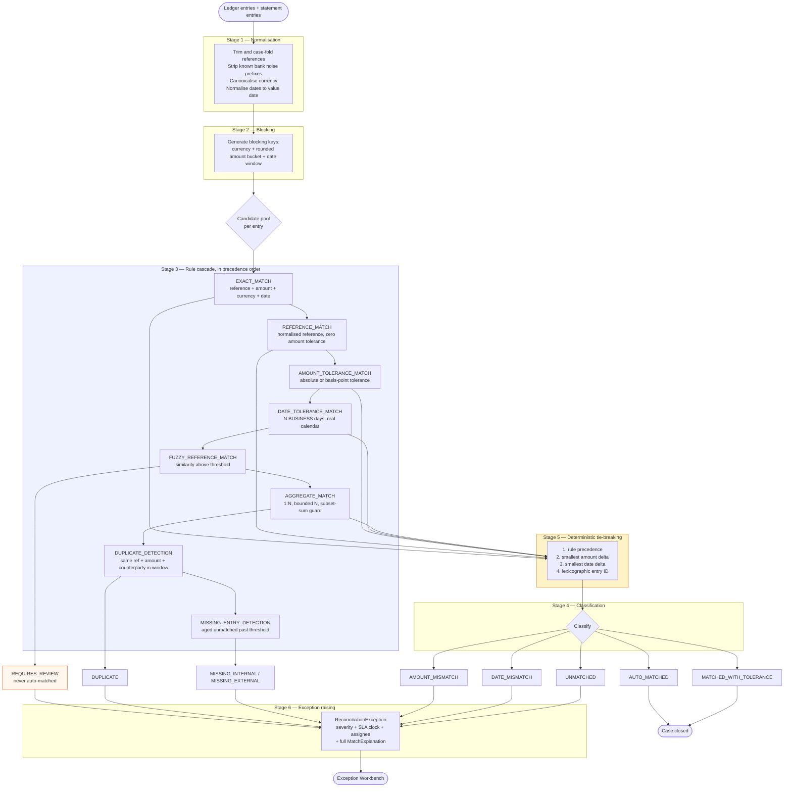

# The reconciliation engine

> **Status.** Design, rule cascade, and the decision flowchart are specified as of Phase 1.
> Implemented and tested in Phase 5, including the jqwik determinism property test and a PIT
> mutation score recorded honestly in `docs/phase-reports/phase-05.md`.

This is the centrepiece of the system. Everything else exists to feed it reliable input and to
carry its decisions to a human.

## 1. Design principles

### 1.1 Deterministic

Same inputs + same rule-set version = **byte-identical outcome, always**.

This is not aspiration; it is the property a property-based test (jqwik) asserts over generated
entry sets, including under **input shuffling**. If reordering the input list changes the outcome,
the engine is wrong — and that bug is invisible in example-based tests because they always supply
the same order.

The most common source of accidental non-determinism is relying on collection iteration order. The
engine never does; ties are broken explicitly (§5).

### 1.2 Explainable

Every `MatchResult` carries a structured `MatchExplanation`:

| Field | Why it is needed |
|---|---|
| Rule ID and **rule version** | A case matched two years ago must be explainable under the rules of that time |
| Candidate pool size | "Why was this the only option?" vs "why this one out of 40?" |
| Fields compared | Makes the comparison auditable |
| Actual deltas — amount delta as `Money`, date delta in days, reference similarity score | The numbers, not an assertion about them |
| Tolerances applied | The threshold the delta was judged against |
| Why competing candidates were rejected | The most valuable field, and the one most systems omit |
| Confidence classification | Feeds the UI's status semantics |

The console renders this as a human-readable "because…" chain, **not a confidence percentage**. A
number like "87% match" tells an analyst nothing actionable. "Reference matched exactly; amount
differs by USD 0.02, within the 5 bps tolerance; the next-best candidate was rejected because its
value date was 4 business days away, outside the 2-day window" is something an analyst can act on
and an auditor can check.

### 1.3 No AI in the decision path

**There is no machine-learning or LLM component anywhere in reconciliation decisions.** This is a
deliberate architectural constraint, not an omission.

Financial correctness requires determinism, reproducibility, and explainability. A model that is
99% accurate is 1% unexplainable, and "the model decided" is not an answer to a regulator asking
why a specific break was auto-matched. The rule cascade is auditable line by line; a model's
weights are not.

The build specification permitted an optional suggest-only assistant. It is **omitted entirely** —
it would add a dependency and a failure mode while buying nothing the deterministic cascade does
not already do better.

### 1.4 Versioned rule sets

Rules are configuration carrying a version identifier that is **persisted onto every result**.
Rule-set changes are themselves audit events. This is what makes §1.2's "explainable under the
rules of the time" claim true rather than aspirational.

## 2. The pipeline

## 3. Stage notes worth stating explicitly

**Stage 2 — blocking and its risk.** Comparing every ledger entry against every statement entry is
O(n²) and becomes unusable at volume. Blocking keys (currency + amount bucket + date window)
reduce the comparison space to entries plausibly related.

**The honest cost: blocking introduces false negatives.** A genuine match whose entries fall into
different blocks is never compared and will surface as an unmatched break. The bucket width and
date window are therefore tuning parameters that trade throughput against recall, and they are
recorded as rule-set configuration rather than hidden constants.

**Stage 3 — `DATE_TOLERANCE_MATCH` uses a real business-day calendar**, not `+N days`. A settlement
window of two business days across a weekend is four calendar days. Getting this wrong produces
breaks every Monday, which is the kind of bug that erodes trust in the whole system.

**Stage 3 — `FUZZY_REFERENCE_MATCH` is always downgraded to `REQUIRES_REVIEW` and never
auto-matched.** Fuzzy string similarity is a heuristic. Allowing a heuristic to close a financial
match automatically is exactly the failure this engine's design rejects.

**Stage 3 — `AGGREGATE_MATCH` is bounded.** One statement entry against N ledger entries summing
within tolerance is a genuine and common case (a batch settlement). But subset-sum is
combinatorially explosive, so N has a **documented limit** and a guard rejects candidate sets that
would exceed the bound rather than attempting them.

**Stage 5 — tie-breaking is the determinism guarantee.** When multiple candidates qualify, ranking
is by rule precedence, then smallest amount delta, then smallest date delta, then lexicographic
entry ID. The final criterion is a total order, so ties are always resolved identically. The test
that shuffles input and asserts identical output is what makes this real.

## 4. Classifications

| Classification | Meaning |
|---|---|
| `AUTO_MATCHED` | Matched with full confidence; no human needed |
| `MATCHED_WITH_TOLERANCE` | Matched within a tolerance; the delta is recorded |
| `REQUIRES_REVIEW` | A candidate exists but confidence is insufficient to auto-match |
| `DUPLICATE` | Same payment presented twice |
| `MISSING_INTERNAL` | External entry with no internal counterpart |
| `MISSING_EXTERNAL` | Internal entry with no external counterpart |
| `AMOUNT_MISMATCH` | Counterpart found, amount outside tolerance |
| `DATE_MISMATCH` | Counterpart found, date outside window |
| `UNMATCHED` | No candidate at all |

## 5. Human workflow

Analysts can **claim**, **investigate**, **force-match**, **write off**, **reject**, or **escalate**.

- Force-match and write-off require **mandatory justification text**.
- Write-off is **amount-capped by role**.
- Force-match is a **privileged action, capped by role, and visibly flagged on the case forever** —
  not just in the audit log. Someone reading the case a year later must see that a human overrode
  the engine without having to go looking.
- Every action is an audit event carrying actor identity.

## 6. What is deliberately not implemented

- **FX conversion.** Cross-currency matching is out of scope for v1. It requires a rate source, a
  rate timestamp, and a conversion audit trail. Cross-currency arithmetic throws
  ([ADR-0009](adr/0009-monetary-representation.md)).
- **Machine learning of any kind** (§1.3).
- **A rules DSL.** Rules are versioned configuration evaluated by ordinary Java. A DSL would mean
  debugging the DSL instead of the rules; see `docs/architecture.md` rejected patterns.
- **Automatic rule tuning.** Thresholds change only by a deliberate, audited rule-set version bump.

## Related

- [`domain-model.md`](domain-model.md) — `Money`, entities, invariants
- [`testing.md`](testing.md) — property tests and the mutation-testing threshold
- [ADR-0009](adr/0009-monetary-representation.md) — why tolerance comparisons are never `equals`
