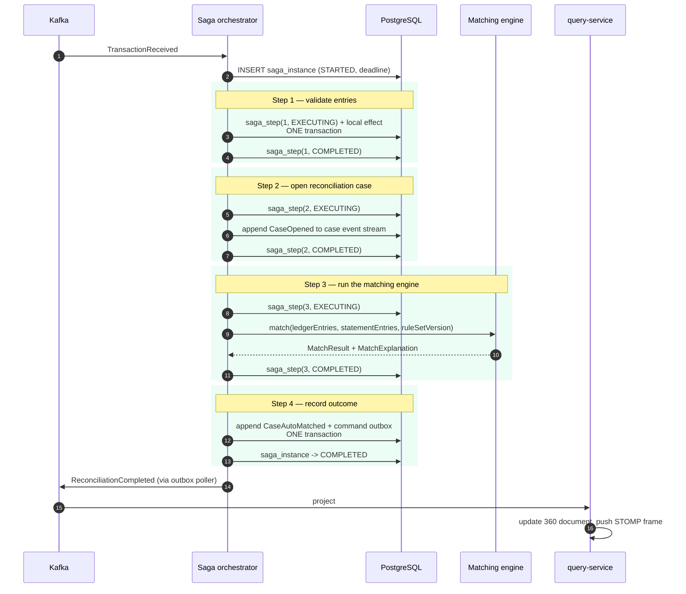
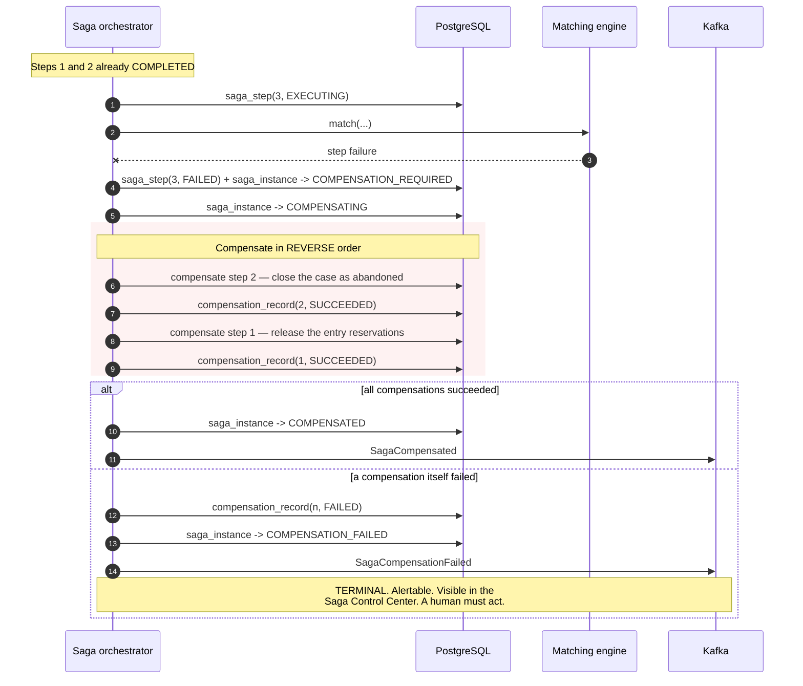

# Saga orchestration

> **Status.** Mechanics and sequences are specified and diagrammed as of Phase 1. Implemented and
> tested in Phase 5. The acceptance evidence — saga success, step failure → compensation,
> compensation failure, and timeout via fixed clock — is recorded in `docs/phase-reports/phase-05.md`.

Reasoning for orchestration over choreography, and for hand-rolling rather than adopting Temporal,
is [ADR-0004](adr/0004-orchestrated-saga-hand-rolled.md).

## 1. Why reconciliation is a saga at all

Reconciliation spans services and has steps with side effects that must be undone if a later step
fails. There is no distributed transaction available, and XA would be the wrong tool even if there
were. So: a saga — a sequence of local transactions, each with a compensating action.

The orchestrator lives in `reconciliation-service` because that service owns the workflow's
meaning. Nothing else in the system decides what reconciliation *is*.

## 2. Persistent state

Three tables. All updated **in the same local transaction as the step's own effect** — a saga whose
state is updated separately from its work can lose track of what it did.

| Table | Grain | Why |
|---|---|---|
| `saga_instance` | One row per workflow instance | Current state, correlation IDs, timeout deadline |
| `saga_step` | One row per step **attempt** | Retries stay visible instead of collapsing into a counter |
| `compensation_record` | One row per compensation executed | Each with its own outcome |

Plus a **command outbox**: the orchestrator's outgoing commands are written in the same transaction
as the state change, so a crash between "decide" and "send" cannot lose the command.

Each step declares, as data: its forward command, its compensating command, a timeout, a retry
policy, and whether failure requires compensation.

## 3. Happy path

## 4. Failure and compensation

Three properties that must hold, and are tested rather than assumed:

1. **Compensations are idempotent.** They run under the same at-least-once delivery as everything
   else, so running one twice must be harmless.
2. **Compensation runs in reverse order.** Step 3's effects are undone before step 2's. This holds
   because the code says so, not because a framework guarantees it — which is precisely why it is
   tested.
3. **Compensation failure is terminal and loud.** `COMPENSATION_FAILED` is never swallowed. The
   system has failed to undo its own partial work, and pretending otherwise leaves silent
   corruption.

## 5. Timeouts

A scheduled sweeper finds instances past their deadline and drives them into
`TIMED_OUT → COMPENSATION_REQUIRED`.

The sweeper reads time from an **injected `java.time.Clock`**. Tests advance a fixed clock rather
than calling `Thread.sleep` — a test that sleeps is slow, flaky, and proves less.

**Honest limitation:** timers are only as durable as the sweeper. If the sweeper does not run,
timeouts do not fire. Temporal's durable timers have no such single point of neglect
([ADR-0004](adr/0004-orchestrated-saga-hand-rolled.md)). The sweeper's liveness is therefore itself
a monitored metric.

## 6. Deliberate failure injection — dev profile only

Demo scenario 6 (§13) requires triggering a compensation on demand. Two mechanisms, both
**structurally impossible to enable under the `prod` profile**:

- a `dev`-profile-only endpoint, and
- a magic reference prefix (e.g. `FAIL-STEP-3-`) recognised only when the injection bean is loaded.

The bean is annotated `@Profile("dev")`. **A test asserts the bean does not load under `prod`** —
because a comment saying "dev only" is not a control, and this is exactly the kind of hook that
ends up in production in real systems.

## 7. Known limitations

Stated here rather than discovered by a reviewer:

- **No workflow versioning.** Changing the step sequence while instances are in flight is not
  handled. Acceptable only because instances are short-lived, so a deploy drains quickly.
- **Compensation ordering is our code's responsibility**, not a framework guarantee.
- **`COMPENSATION_FAILED` has no automated escalation** beyond a metric and UI surfacing.
- **The sweeper is a single point of neglect** for all timeout behaviour.

## Related

- [ADR-0004](adr/0004-orchestrated-saga-hand-rolled.md) — orchestration and the workflow-engine rejection
- [`domain-model.md`](domain-model.md) — the saga state machine
- [`failure-modes.md`](failure-modes.md) — compensation-failure runbook
